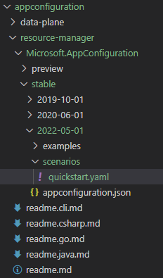
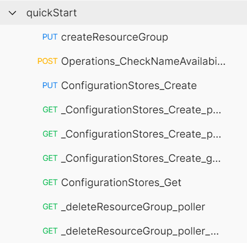

<!--
 Copyright (c) 2021 Microsoft Corporation

 This software is released under the MIT License.
 https://opensource.org/licenses/MIT
-->

# Quick start with API Scenario test

## Install

`oav` is an open-source powerful tool for swagger validation, example generation, and API Scenario testing. GitHub: https://github.com/Azure/oav.

```sh
npm install -g oav@latest
```

### OAV Features

- Very easy to use and run. It supports running API Scenario with ARM Dogfood/Canary/Production environments, and local environment as well.
- Support Postman collection format. Debug easily.
- Traffic schema validation and Azure API guidelines validation. `oav` implements a powerful validation algorithm and help developer to detect service issue in the early phase.
- Generating high quality Swagger examples from API test traffic.
- Validation result report. After each run API scenario, developer will get a validation report which contains detected issue in API test.
- Integrate everywhere. Easily integrate with azure-pipeline, cloud-test.

See `oav run -h` to find all available options.

## Create AAD app

To run API test, first please prepare an AAD app which is used for provisioning Azure resource. Please grant subscription contributor permission to this AAD app.

For how to create AAD app, please follow this doc https://docs.microsoft.com/en-us/azure/active-directory/develop/howto-create-service-principal-portal

## Authoring steps

We will write API scenario file for AppConfiguration service as an example.

#### 1. Write your first API scenario file

First, create a folder `scenarios` under the api version folder. All API scenario files under the `scenarios` folder should bind with the api version.



Now write your basic API scenario. For more detail about API scenario file format, please refer to
[API Scenario Definition Reference](../references/ApiScenarioDefinition.md).

```yaml
# yaml-language-server: $schema=https://raw.githubusercontent.com/Azure/azure-rest-api-specs/main/documentation/api-scenario/references/v1.2/schema.json
scope: ResourceGroup
variables:
  configStoreName:
    type: string
    prefix: configstor

scenarios:
  - scenario: quickStart
    description: Quick start with AppConfiguration ConfigurationStores
    steps:
      - step: Operations_CheckNameAvailability
        exampleFile: ../examples/CheckNameAvailable.json
      - step: ConfigurationStores_Create
        exampleFile: ../examples/ConfigurationStoresCreate.json
      - step: ConfigurationStores_Get
        exampleFile: ../examples/ConfigurationStoresGet.json
```

or use operation based step if Swagger examples are not ready or you want to create more scenarios without writing Swagger examples.

```yaml
# yaml-language-server: $schema=https://raw.githubusercontent.com/Azure/azure-rest-api-specs/main/documentation/api-scenario/references/v1.2/schema.json
scope: ResourceGroup
variables:
  configStoreName:
    type: string
    prefix: configstor

scenarios:
  - scenario: quickStart
    description: Quick start with AppConfiguration ConfigurationStores
    steps:
      - step: Operations_CheckNameAvailability
        operationId: Operations_CheckNameAvailability
        parameters:
          checkNameAvailabilityParameters:
            name: $(configStoreName)
            type: Microsoft.AppConfiguration/configurationStores
      - step: ConfigurationStores_Create
        operationId: ConfigurationStores_Create
        parameters:
          configStoreCreationParameters:
            location: $(location)
            sku:
              name: Standard
            tags:
              myTag: myTagValue
      - step: ConfigurationStores_Get
        operationId: ConfigurationStores_Get
```

#### 2. Create env file

The `env.json` file contains required API scenario variables such as, subscriptionId, AAD applicationId, AAD applicationSecret.

```json
{
  "subscriptionId": "<my subscription id>",
  "location": "westcentralus",
  "tenantId": "<AAD app tenantId>",
  "client_id": "<my add client_id>",
  "client_secret": "<my aad client_secret>"
}
```

#### 3. Run API Scenario test

```sh
oav run ~/workspace/azure-rest-api-specs/specification/appconfiguration/resource-manager/Microsoft.AppConfiguration/stable/2022-05-01/scenarios/quickstart.yaml --tag=package-2022-05-01 -e env.json --verbose
```

#### 4. Debug with Postman

Sometimes the command `oav run` may fail due to non 2xx HTTP status code. Now you need to debug the API scenario with Postman.

When run `run`, it automatically generate Postman collection and postman env in `.apitest/<apiScenarioFile>/<runId>/<scenario>` folder. Here is the output folder structure. The `collection.json` and `env.json` is generated postman collection file and environment file. `202207221820-cyq4mk` is the runId, generated uniquely for each run command.

```
.apitest
└── quickstart.yaml
    └── 202207221820-cyq4mk
        ├── quickStart
        │   ├── collection.json
        │   ├── env.json
        │   └── report.json
        └── quickStart.json
```

Postman is a widely used GUI API testing tool. And you could use Postman import the generated postman collection and env for your local debug.


After you import Postman collection, you will get such requests. Now you could debug API test with postman locally.



#### 5. Manual update API Scenario or example

After debug with Postman, you need to rewrite back all the updated values and run `oav run <api-scenario-file> -e <env.json>` again. The result should be successful.

## Feedback

If you have any question, feel free to send email to vscswagger@microsoft.com
